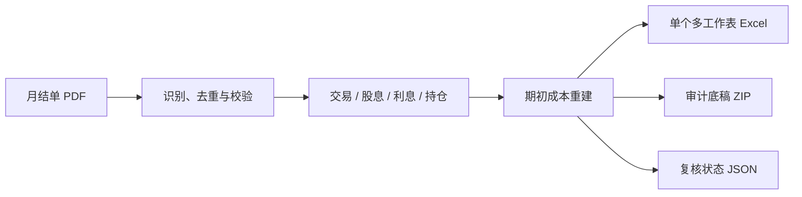

<p align="center">
  
</p>

# 长桥证券税务工作底稿

[](https://github.com/Patrickpoix/longbridge-tax-workpaper/actions/workflows/ci.yml)
[](https://www.python.org/)
[](LICENSE.txt)

> 独立社区项目，与长桥证券无隶属、授权或背书关系。输出是便于个人复核的工作底稿，不是自动生成的正式纳税申报表。

把同一长桥证券账户的月结单 PDF 转换为：

- 一个中文、多工作表 Excel；
- 一个独立审计底稿 ZIP；
- 一个适合对外审阅的精简 ZIP；
- 一个“复核就绪性”JSON。

适用范围是中国内地税收居民、单一长桥证券账户的税务整理场景。本项目生成可追溯工作底稿和并列测算情景，不替代主管税务机关或专业税务意见。

## 它解决什么问题

- 一次放入同一账户的全年月结单，不需要手工拆成多份 Excel；
- 2024、2025 以及未来年度共用同一套年度发现逻辑，不把年份写死；
- FIFO 与移动加权平均并列测算，只统计已实现盈亏；
- 缺月份、缺汇率、缺期初成本证据时仍尽量生成底稿，但明确标记复核阻断；
- 默认不把原始 PDF 打进交付包，降低误传隐私资料的风险。



## Quick Start (3 steps)

### Windows
1. Double-click start.bat
2. Follow prompts for PDF folder and password
3. Check outputs/ folder for results

### Command Line
pip install .
python -m longbridge_tax_workpaper <pdf-dir> --output-dir outputs --tax-year 2025 --fx USD=7.0288 --fx HKD=0.90322

### Direct run (no install)
python scripts/run_workpaper.py <pdf-dir> --output-dir outputs --tax-year 2025
## 环境要求

- Python 3.11、3.12 或 3.13；
- 月结单如已加密，需要 PDF 密码；
- Excel 使用公开可安装的 `openpyxl`，不依赖专有运行库。

项目源码位于 `scripts/longbridge_tax_workpaper/`，但正常使用无需设置 `PYTHONPATH`。

## 安装

```bash
python -m venv .venv
# Windows PowerShell: .venv\Scripts\Activate.ps1
# Windows CMD:        .venv\Scripts\activate.bat
# macOS/Linux:        source .venv/bin/activate

python -m pip install --upgrade pip
python -m pip install .
```

如月结单是扫描件、内嵌字体无法正确解码，或出现 `unknown_template`，可安装可选 OCR 后备：

```bash
python -m pip install ".[ocr]"
```

程序默认先使用 PDF 文本层；仅在文本质量异常或版式识别失败时调用 OCR。可用 `--disable-ocr` 明确关闭。OCR 结果仍需通过月份、账户、行列和金额校验，低置信度或冲突结果会进入复核状态，不会静默覆盖可靠的原生文本。

开发和测试：

```bash
python -m pip install -e ".[dev]" -c constraints.txt
python -m pytest -q
```

## 使用

密码只通过环境变量传入，避免进入 shell 历史、进程参数、日志或清单。

```bash
# Windows CMD
set LONGBRIDGE_PDF_PASSWORD=你的密码

# Windows PowerShell
$env:LONGBRIDGE_PDF_PASSWORD="你的密码"

# macOS/Linux
export LONGBRIDGE_PDF_PASSWORD='你的密码'
```

当输入目录中存在一个完整的 1—12 月年度时，可以自动选择最新完整年度：

```bash
longbridge-tax-workpaper 月结单目录 --output-dir outputs \
  --fx USD=7.0288 --fx HKD=0.90322 \
  --fx-source USD=https://官方来源.example/announcement \
  --fx-source HKD=https://官方来源.example/announcement \
  --fx-source-date USD=2025-12-31 \
  --fx-source-date HKD=2025-12-31
```

也可显式指定年度：

```bash
longbridge-tax-workpaper 月结单目录 \
  --output-dir outputs \
  --tax-year 2026 \
  --fx USD=7.0000 \
  --fx HKD=0.9000
```

如果未指定年度且没有任何完整 1—12 月年度，程序会停止并要求补齐或显式指定年度。显式指定不完整年度时仍可生成工作底稿，但“月度覆盖”会阻断复核。

缺少 USD/CNY 或 HKD/CNY 年末汇率时，人民币字段保持为空并标记 `INCOMPLETE_MISSING_FX`；绝不会用 `0` 代替未知汇率。

没有安装控制台入口时的等价调用是：

```bash
python -m longbridge_tax_workpaper 月结单目录 --output-dir outputs ...
```

## 输出

- `longbridge_<年度>_processed_results.xlsx`：单一、多工作表 Excel；
- `longbridge_<年度>_workpapers.zip`：JSON、CSV、配置、哈希、证据及可选原始 PDF；
- `longbridge_<年度>_processed_delivery.zip`：不含原始 PDF 的精简审阅包；
- `review_status_<年度>.json`：技术完整性和税务复核风险，不代表可直接申报。

默认**不把原始 PDF 复制进底稿 ZIP**。只有明确需要本地归档时才使用：

```bash
--include-source-pdfs
```

原始券商月结单含高度敏感的账户、持仓和交易信息。不要把包含 PDF 的底稿包发给无关第三方；对外审阅优先使用 `processed_delivery.zip`。

## 关键可靠性规则

- 未知版式返回 `unknown_template` 并阻断结构化税务输出；
- 表头识别使用规范化别名与能力特征，不按 2024、2025 等年份写死版式；
- 内嵌字体损坏、连续乱码或关键锚点缺失时可自动 OCR 二次识别；OCR 临时图片自动清除；
- PDF 文本缓存只有在文件名和源 PDF SHA-256 均匹配时才使用；
- 输入发现排除输出目录和底稿目录，并按 SHA-256 去重；
- 自动年度选择严格要求 `{01, 02, ..., 12}`；
- 期初成本从税年前真实成交和费用重建，不使用可能为负的券商摊薄展示成本；
- 只统计已实现盈亏，未实现盈亏不进入年度结果；
- FIFO 和移动加权平均并列输出；
- 预扣税默认只是抵免候选，无合格凭证时自动抵免为零；
- 融资利息应计和实际支付分别列示，默认不税前扣除；
- 汇率换算、税额和最终汇总使用 `Decimal` 与 `ROUND_HALF_UP`；成本账保留 8 位内部精度，人民币展示保留 2 位。解析层仍可能接收 PDF 浮点值，但进入税务汇总前会按统一精度规则规范化。

更多说明见 `references/`。
