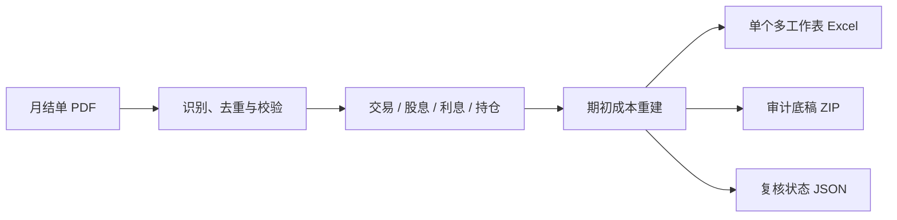

<p align="center">
  
</p>

# 长桥证券税务工作底稿

[](https://github.com/Patrickpoix/longbridge-tax-workpaper/actions/workflows/ci.yml)
[](https://www.python.org/)
[](LICENSE.txt)

> 独立社区项目，与长桥证券无隶属、授权或背书关系。输出是便于个人复核的工作底稿，不是自动生成的正式纳税申报表。

把同一长桥证券账户的月结单 PDF 转换为：

- 一个中文、多工作表 Excel；
- 一个完整审计底稿 ZIP；
- 一个仍含账户/交易级信息的专业复核 ZIP；
- 一个去除账户号、交易明细、持仓明细和来源文件追溯信息的脱敏汇总 ZIP；
- 一个“复核就绪性”JSON。

适用范围是中国内地税收居民、单一长桥证券账户的税务整理场景。本项目生成可追溯工作底稿和并列测算情景，不替代主管税务机关或专业税务意见。

## 它解决什么问题

- 一次放入同一账户的全年月结单，不需要手工拆成多份 Excel；
- 2024、2025 以及未来年度共用同一套年度发现逻辑，不把年份写死；
- FIFO 与移动加权平均并列测算，只统计已实现盈亏；
- 缺月份、缺汇率、缺期初成本证据时仍尽量生成底稿，但明确标记复核阻断；
- 默认不把原始 PDF 打进交付包，降低误传隐私资料的风险。


```mermaid
flowchart LR
  A[月结单 PDF] --> B[识别、去重与校验]
  B --> C[交易 / 股息 / 利息 / 持仓]
  C --> D[期初成本重建]
  D --> E[单个多工作表 Excel]
  D --> F[审计底稿 ZIP]
  D --> G[复核状态 JSON]
```

## 快速开始（三步）

### Windows
1. 双击 `start.bat`
2. 按提示输入月结单目录和密码
3. 查看 `outputs/` 文件夹中的结果

### 命令行安装运行
```bash
pip install .
python -m longbridge_tax_workpaper <pdf-dir> --output-dir outputs --tax-year 2025 --fx USD=7.0288 --fx HKD=0.90322
```

### 直接运行（无需安装）
```bash
python scripts/run_workpaper.py <pdf-dir> --output-dir outputs --tax-year 2025
```
## 环境要求

- Python 3.11、3.12 或 3.13；
- 月结单如已加密，需要 PDF 密码；
- Excel 使用公开可安装的 `openpyxl`，不依赖专有运行库。

项目源码位于 `scripts/longbridge_tax_workpaper/`，但正常使用无需设置 `PYTHONPATH`。

## 安装

```bash
python -m venv .venv
# Windows PowerShell: .venv\Scripts\Activate.ps1
# Windows CMD:        .venv\Scripts\activate.bat
# macOS/Linux:        source .venv/bin/activate

python -m pip install --upgrade pip
python -m pip install .
```

如月结单是扫描件、内嵌字体无法正确解码，或出现 `unknown_template`，可安装可选 OCR 后备：

```bash
python -m pip install ".[ocr]"
```

程序默认先使用 PDF 文本层；仅在文本质量异常或版式识别失败时调用 OCR。可用 `--disable-ocr` 明确关闭。OCR 结果仍需通过月份、账户、行列和金额校验，低置信度或冲突结果会进入复核状态，不会静默覆盖可靠的原生文本。

开发和测试：

```bash
python -m pip install -e ".[dev]" -c constraints.txt
python -m pytest -q
```

## 使用

工具会递归扫描输入目录及其子目录中的所有 `*.pdf` 文件，无需逐个指定。

交互模式使用隐藏输入（`getpass`）读取密码；非交互运行推荐通过当前进程的
`LONGBRIDGE_PDF_PASSWORD` 环境变量提供。不要把密码放进 CLI 参数、源码、日志、工作簿或清单。

```bash
# Windows CMD
set LONGBRIDGE_PDF_PASSWORD=你的密码

# Windows PowerShell
$env:LONGBRIDGE_PDF_PASSWORD="你的密码"

# macOS/Linux
export LONGBRIDGE_PDF_PASSWORD='你的密码'
```

当输入目录中存在一个完整的 1—12 月年度时，可以自动选择最新完整年度：

```bash
longbridge-tax-workpaper 月结单目录 --output-dir outputs \
  --fx USD=7.0288 --fx HKD=0.90322 \
  --fx-source USD=https://官方来源.example/announcement \
  --fx-source HKD=https://官方来源.example/announcement \
  --fx-source-date USD=2025-12-31 \
  --fx-source-date HKD=2025-12-31
```

也可显式指定年度：

```bash
longbridge-tax-workpaper 月结单目录 \
  --output-dir outputs \
  --tax-year 2026 \
  --fx USD=7.0000 \
  --fx HKD=0.9000
```

如果未指定年度且没有任何完整 1—12 月年度，程序会停止并要求补齐或显式指定年度。显式指定不完整年度时仍可生成工作底稿，但“月度覆盖”会阻断复核。

缺少 USD/CNY 或 HKD/CNY 年末汇率时，人民币字段保持为空并标记 `INCOMPLETE_MISSING_FX`；绝不会用 `0` 代替未知汇率。

没有安装控制台入口时的等价调用是：

```bash
python -m longbridge_tax_workpaper 月结单目录 --output-dir outputs ...
```

### 税务口径选择（v1.0.0 新增）

默认主复核方法为 `MOVING_AVERAGE`。完整工作簿仍保留 FIFO 与移动加权平均两套结果用于审计对照；
`--cost-basis-method` 选择的是主复核/阻断方法，而不是删除另一套审计结果。

```bash
# 使用券商展示成本（移动平均），无需前期月结单
longbridge-tax-workpaper 月结单目录 --fx USD=7.19 --cost-basis-method MOVING_AVERAGE

# FIFO 先进先出；年初已有持仓的标的需要历史成本证据
longbridge-tax-workpaper 月结单目录 --fx USD=7.19 --cost-basis-method FIFO

# 历史月结单可来自多个独立目录；参数可重复
longbridge-tax-workpaper 月结单目录 --extra-input-dir 历史目录A --extra-input-dir 历史目录B \
  --fx USD=7.19 --cost-basis-method FIFO

# 请求在测算中应用月结单预扣税抵免候选（默认关闭；仍需凭证/人工复核）
longbridge-tax-workpaper 月结单目录 --fx USD=7.19 --withholding-credit

# 请求把融资利息列为扣除候选（默认不扣除；不会自动认定法律上可扣除）
longbridge-tax-workpaper 月结单目录 --fx USD=7.19 --deduct-margin-interest

# 组合使用
longbridge-tax-workpaper 月结单目录 --fx USD=7.19 --fx HKD=0.92 \
  --cost-basis-method FIFO --withholding-credit --deduct-margin-interest
```

## 输出

- `longbridge_<年度>_processed_results.xlsx`：单一、多工作表 Excel；
- `longbridge_<年度>_workpapers.zip`：最高敏感级别；含 JSON、CSV、配置、哈希、证据及可选原始 PDF；
- `longbridge_<年度>_processed_delivery.zip`：不含原始 PDF，但仍含账户、交易、持仓和文件追溯等敏感专业复核信息；
- `longbridge_<年度>_sanitized_delivery.zip`：脱敏汇总复核包；只含 5 张汇总/复核工作表、脱敏 review status、README 和 manifest；
- `review_status_<年度>.json`：技术完整性和税务复核风险，不代表可直接申报。

默认**不把原始 PDF 复制进底稿 ZIP**。只有明确需要本地归档时才使用：

```bash
--include-source-pdfs
```

原始券商月结单含高度敏感的账户、持仓和交易信息。`processed_delivery.zip` 虽不含 PDF，仍不是匿名包；
只有在去标识化年度汇总足以满足审阅目的时，才优先使用 `sanitized_delivery.zip`。年度汇总金额本身仍属于敏感财务信息。

### 历史持仓成本追溯

计算 FIFO 已实现盈亏时，系统需要逐笔匹配买入和卖出记录。

**什么情况需要提供历史月结单？**
- 只要某只标的在纳税年初已有正持仓，FIFO 就需要能解释该期初库存来源和剩余数量的历史成交/持仓证据；
- 即使该标的在纳税年度内后来又发生买入，也不能用当年买入替代年初库存的历史成本证据；
- 可通过重复 `--extra-input-dir` 从多个历史目录补充证据，输入会按 PDF SHA-256 去重。

**不提供会怎样？**
- 系统不会把成本算作 0——长桥月结单本身就展示成本（移动平均口径）
- 移动加权平均仍可使用可解释的正数券商展示期初成本作为候选计算依据；
- FIFO 会保留历史证据缺口并进入对应方法的复核错误，不会把缺失成本当成 0；
- 主方法为 `MOVING_AVERAGE` 时，FIFO-only 历史缺口不会错误阻断移动平均成本引擎。

**什么情况不需要？**
- 选择 MOVING_AVERAGE（默认）模式：直接使用券商展示成本，**无需任何历史月结单**
- 选择 FIFO/BOTH，但某标的在纳税年初没有持仓：该标的无需为 FIFO 额外补充年初以前的历史成本证据

## 关键可靠性规则

- 未知版式返回 `unknown_template` 并阻断结构化税务输出；
- 表头识别使用规范化别名与能力特征，不按 2024、2025 等年份写死版式；
- 内嵌字体损坏、连续乱码或关键锚点缺失时可自动 OCR 二次识别；OCR 临时图片自动清除；
- PDF 文本缓存只有在文件名和源 PDF SHA-256 均匹配时才使用；
- 输入发现排除输出目录和底稿目录，并按 SHA-256 去重；
- 自动年度选择严格要求 `{01, 02, ..., 12}`；
- 期初成本从税年前真实成交和费用重建，不使用可能为负的券商摊薄展示成本；
- 只统计已实现盈亏，未实现盈亏不进入年度结果；
- FIFO 和移动加权平均始终并列输出；默认主复核方法为移动加权平均；
- 预扣税默认只作为抵免候选；显式 `--withholding-credit` 后按中国税额上限应用候选，但仍产生税务证据 WARNING，不能视为最终抵免资格确认；
- 融资利息应计和实际支付分别列示；`--deduct-margin-interest` 只表达扣除请求/候选，默认不自动进入最终扣除；
- 汇率、关键货币金额计算与成本分配在统一 `Decimal` 精度边界规范化（内部 8 位、CNY 输出 2 位、`ROUND_HALF_UP`）；解析器与部分数量字段仍可能使用 `float`，不宣称全链路都是 Decimal。

更多说明见 `references/`。
